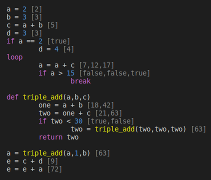

# cranelift-lang

Goal: As much compile time analysis as possible.

E.g.

`cargo test -- --nocapture` with outputs



Where `example-input` is:
```
a = 2
b = 3
c = a + b
d = 3
if a == 2
    d = 4

loop
    a = a + c
    if a > 15
        break

def triple_add(a,b,c,)
    one = a + b
    two = one + c
    if two < 30
        two = triple_add(two,two,two,)
    return two

a = triple_add(a,1,b,)

e = c + d
e = e + a
```
