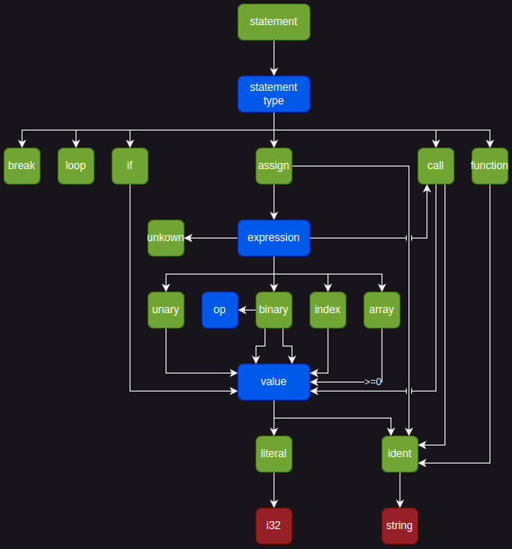

# cranelift-lang

Goal: As much compile time analysis as possible.

### AST

The goal is to have a very simple language.

A visualization I use for illustrate the abstract syntax tree:



### Compile-time evaluation

[`input-one`](./input-one.png)

becomes

[`output-one`](./output-one.png)

by removing 1 line `c = d + c` we have

[`input-two](./input-two.png)

which becomes 

[`output-two`](./output-two.png)

### Parsing

```txt
a = 2
b = 3
c = a + b
d = ?
if 1
    c = d + c
    d = 4
a = d
loop
    a = a + c
    if 1
        break
def triple_add(a,b,c,)
    one = a + b
    two = one + c
    if 0
        two = triple_add(two,two,two,)
    return two
a = triple_add(a,1,b,)
e = c + d
e = e + a
e = ? + e
if 1
    return e
return 1
```

becomes

[`parsing-output`](./parsing-output.png)