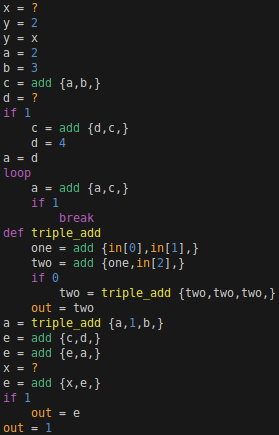

# cranelift-lang

Goal: As much compile time analysis as possible.

### AST

The goal is to have a very simple language.

A visualization I use for illustrate the abstract syntax tree:


### Compile-time evaluation

```
x = ?
y = 2
y = x
a = 2
b = 3
c = a + b
d = ?
if 1
    c = d + c
    d = 4
a = d
loop
    a = a + c
    if 1
        break
def triple_add(a,b,c,)
    one = a + b
    two = one + c
    if 0
        two = triple_add(two,two,two,)
    return two
a = triple_add(a,1,b,)
e = c + d
e = e + a
x = ?
e = x + e
if 1
    return e
return 1
```

becomes

```
x = ?
d = ?
c = d + 5
a = 4 + c
_one = a + 1
_two = _one + 1
e = 7 + _two
x = ?
e = x + e
return e
```

by removing 1 line (`c = d + c`) it becomes

```
x = ?
e = x + 18
return e
```

### Parsing

```txt
x = ?
y = 2
y = x
a = 2
b = 3
c = a + b
d = ?
if 1
    c = d + c
    d = 4
a = d
loop
    a = a + c
    if 1
        break
def triple_add(a,b,c,)
    one = a + b
    two = one + c
    if 0
        two = triple_add(two,two,two,)
    return two
a = triple_add(a,1,b,)
e = c + d
e = e + a
x = ?
e = x + e
if 1
    return e
return 1
```

becomes

