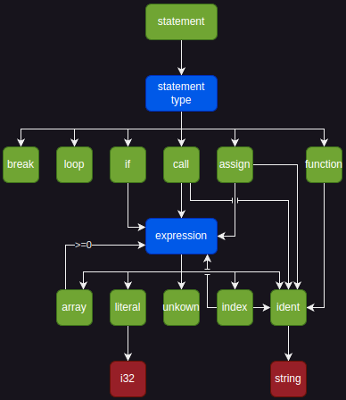

# cranelift-lang

Goal: As much compile time analysis as possible.

### AST

The goal is to have a very simple language.

A visualization I use for illustrate the abstract syntax tree:

### Example

`cargo test -- --nocapture` with outputs

See [`example-input`](./example-input.txt).
